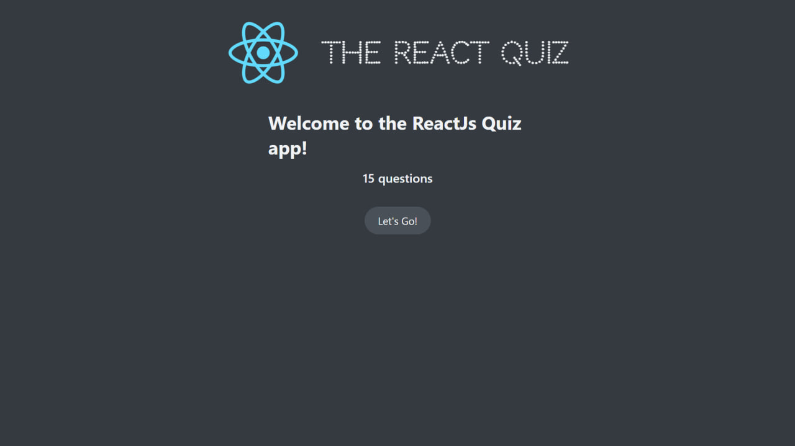
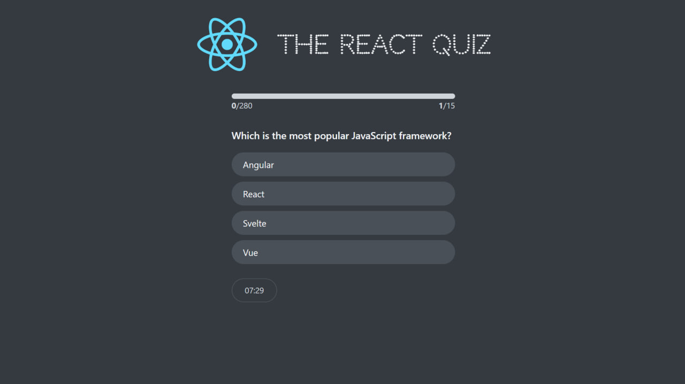
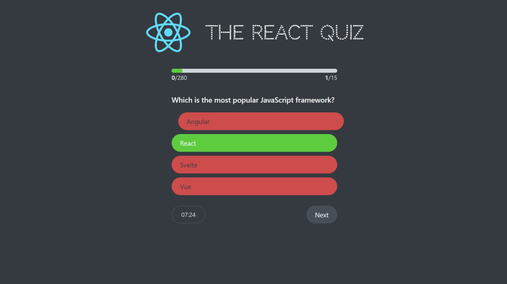
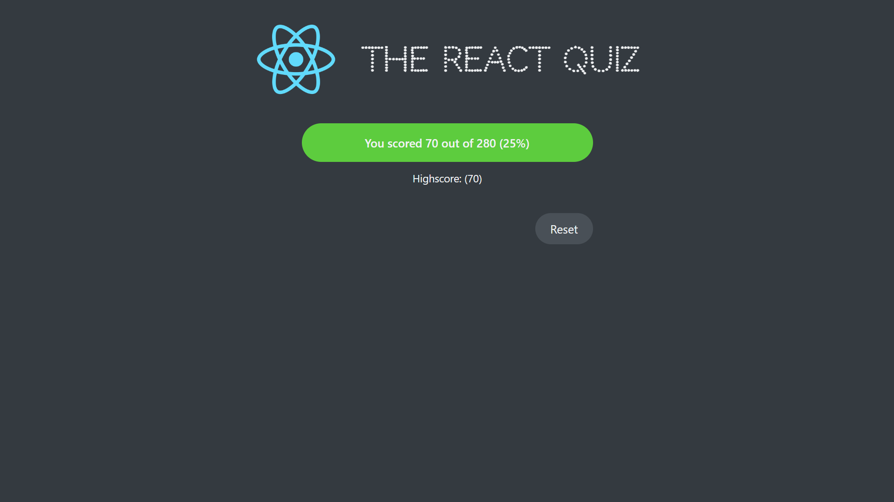

# 🧠 React JS Quiz App

Welcome to **React JS Quiz App**! 🎉 This is an interactive quiz app built with React, designed to challenge your knowledge on various topics. Users can take quizzes, receive immediate feedback, and track their scores.

🌐 **[Live Demo](#)**

---

## ✨ Features

- **Interactive Quizzes**: Test your knowledge with different quiz questions.
- **Real-Time Feedback**: Know immediately whether your answer is correct or wrong.
- **Score Tracking**: See how well you performed on each quiz.
- **Dynamic Data**: The quiz questions are fetched from a JSON file.
- **Responsive Design**: Enjoy the app on any device, whether mobile or desktop.

---

## 🚀 Getting Started

### Prerequisites

Ensure you have the following installed:

- Node.js (v14+)
- npm (v6+)

### Installation

1. Clone the repository:

   ```bash
   git clone https://github.com/ariyagoudarzi/React-Js-Quiz-App.git
   ```

2. Navigate to the project directory:

   ```bash
   cd React-Js-Quiz-App
   ```

3. Install dependencies:

   ```bash
   npm install
   ```

4. Install `json-server`:

   ```bash
   npm i json-server
   ```

5. In the `package.json` file, ensure the script section includes:

   ```json
   "server": "json-server --watch data/questions.json --port 800"
   ```

6. Run the JSON server in one terminal:

   ```bash
   npm run server
   ```

7. In a second terminal, start the React app:

   ```bash
   npm start
   ```

---

## 📸 Screenshots

1. **Home Screen**

   

2. **Quiz Questions**

   

3. **Real-Time Feedback**

   

4. **Score Summary**

   

5. **Responsive Design**

   

---

## 🛠️ Technologies Used

- **React**: For building the UI.
- **CSS**: For styling the app.
- **JSON Server**: For simulating an API.

---

## ⭐ Show Your Support

If you enjoyed using this app, consider giving it a **star** on GitHub! ⭐

---

## 📄 License

This project is licensed under the MIT License.
